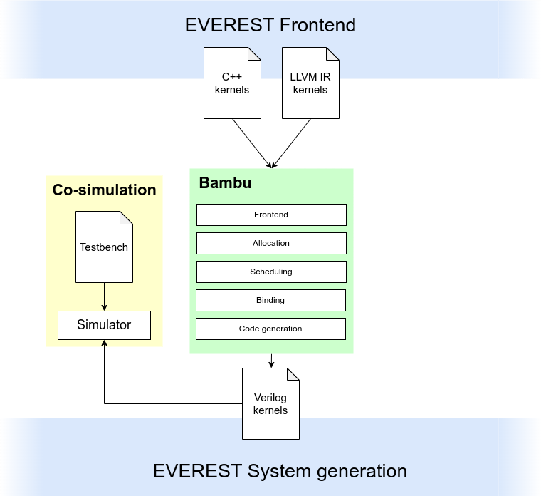

This folder contains the source code for the HLS tool Bambu and instructions to download a pre-built AppImage executable for the 2024.1 release.

Bambu is used in the EVEREST SDK to generate hardware accelerators. A simulator (e.g., open-source tool Verilator) is required and has to be installed separately.

