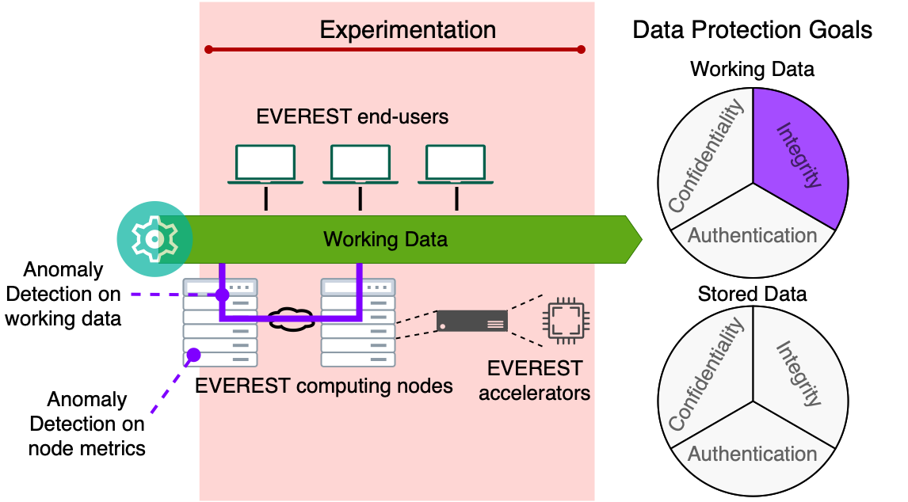

This folder contains the source code for ADLib, the anomaly detection library developed as a part of EVEREST.

ADLib can be used as a stand-alone library directly with python, or within a container. Installation of the dependencies is described in the README of ADLib.

